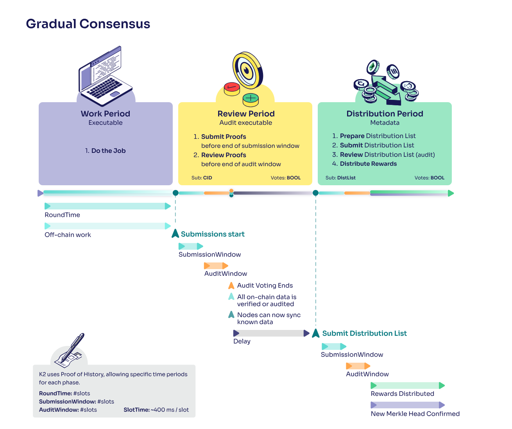

# Part II: Task Flow

Now that your node is up and running, you'll want to start by getting the feel for the logs.

## 
### Logs

For example, try tail'ing the logs file and then clicking some buttons in the node (i.e. Play and Pause Tasks). You'll immediately see the logs.

i.e. `tail -f main.log`

### Debug Mode

## Task Flow
Tasks run in round-based cycles, similar to Epochs in a Proof-of-History flow. 

Tasks include two kinds of programs:
1. Continuous: These run like a normal server, and start whenever the Task reboots
    a. REST APIs
    b. Databases
    c. Utility Modules

2. Cyclical: These run once per round (you'll set the `round_time` when you deploy later on)
    a. Governance Functions
    b. Timed Workloads like Replication 

### Debugging Flow
First, we'll add some debug logs, and then we can watch how these functions run over time.

Open the `project/` folder again and we'll start hacking through some files.

We will make 4 key changes
1. 

### Consensus
Each round, all nodes have an opportunity to claim rewards proportionate to the work they've contributed. 

Typically, each node provides some 'proofs' of their work, and these can optionally be audited by another node.

#### Audits
Cyclical programs (see (2.) above) autonomously comb over proofs to see if they correspond correctly to the work claimed. If the work doesn't match the expected behaviour, an Audit can be submitted by any node, and any nodes that verify receive a share of the slashed collateral. 

Audits can of course be audited, leading to a consensus backed by collateral and reputation but with near-instant settlement. In most cases, even multi-layer audits only take a couple of seconds. 

