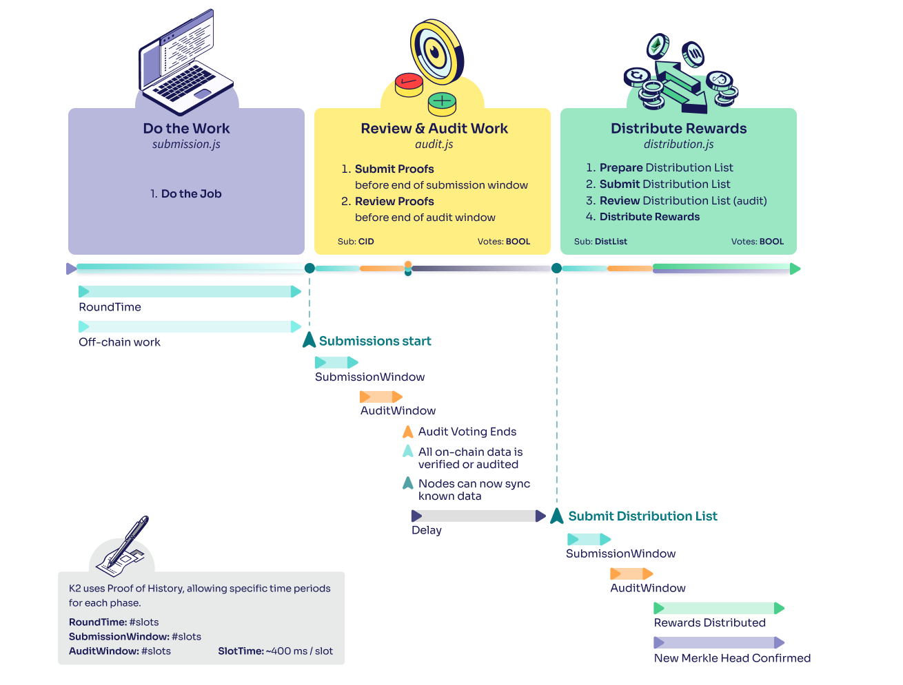
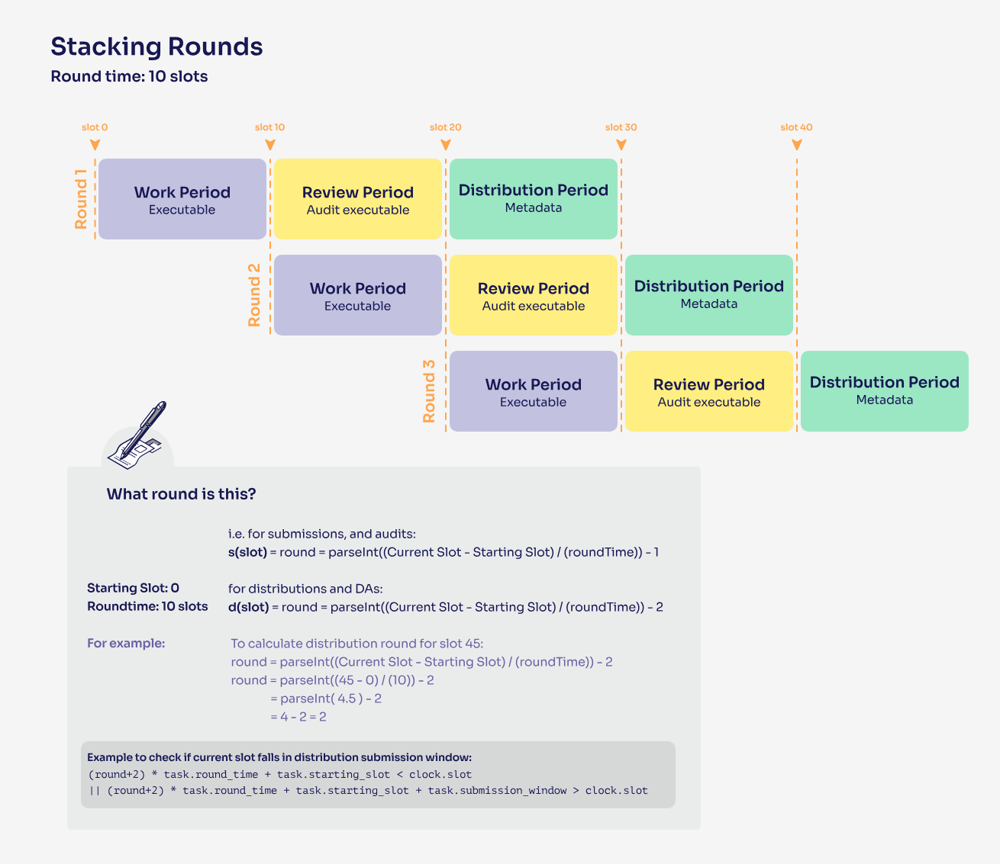

# Part III: Consensus

Each round, all nodes have an opportunity to claim rewards proportionate to the work they've contributed.

Typically, each node provides some 'proofs' of their work, and these can optionally be audited by another node.

In each round, a series of on-chain transactions are recorded to track the work done, or allow for one node to raise an alarm if they catch another misbehaving.

Because rounds run concurrently, there is always one active Task, Submission, Audit, or Distribution window at any time.

## Task (`corelogic.task()`)

This contains programs that should run at the start of each task.

## FetchSubmission (`corelogic.fetchSubmission()`)

This is where we will prepare a submission and the node will attempt to claim rewards.

## Calculate Rewards (`corelogic.generateDistribution()`)

This is where each node will review other's submissions and calculate how much rewards to pay.

## Audits (`corelogic.validateNode()`)

Cyclical programs (see (2.) above) autonomously comb over proofs to see if they correspond correctly to the work claimed. If the work doesn't match the expected behaviour, an Audit can be submitted by any node, and any nodes that verify receive a share of the slashed collateral.

Audits can of course be audited, leading to a consensus backed by collateral and reputation but with near-instant settlement. In most cases, even multi-layer audits only take a couple of seconds.

Audits are not always necessary, especially if you're just starting out. It may be easier to permission which public keys can participate in the task, instead of requiring a new node to prove its trustworthiness through past contributions. However, as the network and the stakes grow, the need for audits become more critical to maintain integrity and prevent malicious behaviour.
