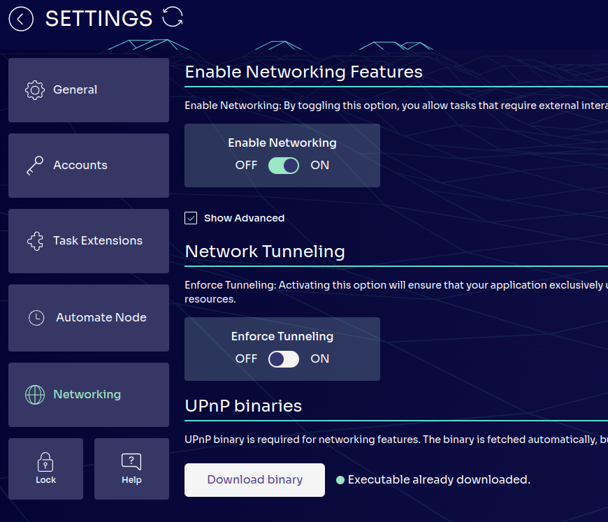

# Lesson 2: Storage & Networking

This lesson covers how to allow nodes to interact with one another.

## Part I. Node to Node Communication

So far, we've become familiar with deploying and debugging our own tasks on the Node application. Everything we've done so far has only really invovled a single node, with a task that was independent of other nodes.

This may not always be the case however; having a way to collaborate with other nodes can be extremely useful for writing tasks used for mathematical computations, file sharing, or even instant messaging.

### Koii on UPnP

Koii makes this possible with the help of Universal Plug and Play (UPnP). Put simply, UPnP is a set of networking protocols that allows a network of devices to seamlessly connect to eachother. UPnP is most commonly used by devices like gaming consoles and smart devices which makes connecting to these devices very straight forward.

You can think of your Node like a personal gaming console where enabling UPnP allows you to connect with other players!

### Enabling UPnP in the Node

To enable UPnP on your Node, head to Settings -> Networking -> Enable Networking Features and simply toggle on the `Enable Networking` feature.

Additionally, check the advanced tab to download the required UPnP binaries if you haven't already or if you deleted it by mistake!

### UPnP Security on Koii

As mentioned above, UPnP is awesome because it greatly reduces the complexity required for having interconnected devices. One of the tradeoffs for this functionality, is that there may be some security concerns regarding allowing direct access into your device.

At Koii, we recognize the potential security concerns which is why UPnP is NOT required for you to use the Node. You are free to enable or disable it as you see fit. Additionally, if you want to use UPnP but still stay secure, you can manually use tunneling by toggling the `Enforce Tunneling` option as shown in the screenshot above.

Tunneling allows your device to set up a proxy before connecting with other devices, which enhances security since your device won't be completely exposed to another. Some routers may not allow UPnP at all, so your device may use tunneling by default!

UPnP allows Koii tasks to utilize our vast network of over 60,000 Nodes to communicate effectively which is why it is such a powerful tool. Any tasks whitelisted by Koii are publicly available to inspect so you can be assured that UPnP is being used for productivity, not malice.

In the next lesson, we'll learn how we can write our own task that makes use of UPnP for networking!

[Click here to start PartII: Writing Networking Tasks](./PartII.md)
